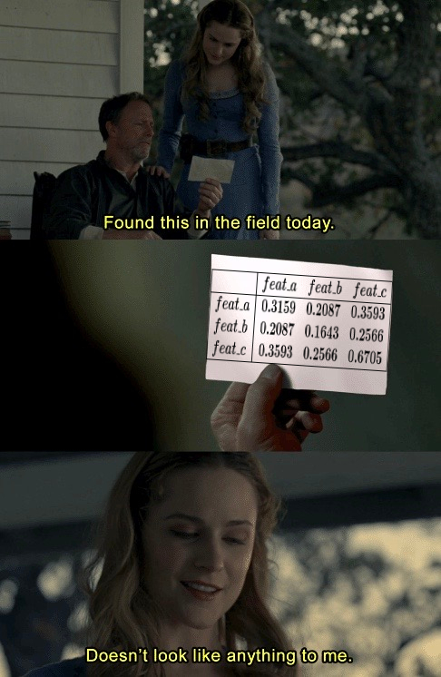

# What do Principal Components Actually do Mathematically?
I have recently taken an interest in PCA after watching Professor Gilbert Strang’s [PCA lecture](https://www.youtube.com/watch?v=Y4f7K9XF04k). I must have watched at least 15 other videos and read 7 different blog posts on PCA since. They are all very excellent resources, but I found myself somewhat unsatisfied. What they do a lot is teaching us the following:
- What the PCA promise is;
- Why that promise is very useful in Data Science; and
- How to extract these principal components. (Although I don't agree with how some of them do it by applying SVD on the covariance matrix, that can be saved for another post.)

Some of them go the extra mile to show us graphically or logically, how the promise is being fulfilled by the principal components:
- Graphically, a transformed vector can be shown to be still clustered with its original group in a plot; and
- Logically, a proof can be expressed in mathematical symbols.

## Objective
My mind was convinced, but my heart was still not. To me, the graphic approach does not provide a visual effect that is striking enough. The logic approach, on the other hand, does not even spend enough effort to explain what precisely it's trying to prove. Therefore, the objective of this post is to improve both of these 2 areas - to provide a more striking visual and to establish a more precise goal for our mathematical proof.

## Prerequisites
This post is for you if:
- You have at least a slight idea of what the PCA promise is;
- You have a decent understanding of what the covariance matrix is about;
- You have a solid foundation in linear algebra, e.g., comfortable with the concept of matrices being transformations that rotate and/or stretch spaces; and
- Your heart is longing to discover the principal components, instead of being told what they are!

## How to Choose P?
After hearing my dissatisfaction, my friend [Calvin](https://calvinfeng.github.io/) recommended this paper by Jonathon Shlens - [A Tutorial on Principal Component Analysis](https://arxiv.org/pdf/1404.1100.pdf) to me. It is by far the best resource I have come across on PCA. However, it's also a bit lengthier than your typical blog post, so the remainder of this post will focus on section 5 of the paper. In there, Jonathon immediately establishes the following goal:
> The [original] dataset is $$X$$, an $$m × n$$ matrix.<br>
> Find some orthonormal matrix $$P$$ in $$Y = PX$$ such that $$C_Y \equiv \frac{1}{n}YY^T$$ is a diagonal matrix.[1]<br>
> The rows of $$P$$ shall be principal components of $$X$$.

As you might have noticed, $$C_Y$$ here is the covariance matrix of our rotated dataset $$Y$$. Why do we want $$C_Y$$ to be diagonal? Before we answer this question, let’s generate a dataset $$X$$ consisting of 4 features with some random values.


```python
from IPython.display import Latex, display
from string import ascii_lowercase
import numpy as np
import pandas as pd

# constants
FEAT_NUM, SAMPLE_NUM = 4, 4

# helpers
def covariance_matrix(dataset):
    return dataset @ dataset.transpose() / SAMPLE_NUM

def tabulate(dataset, rotated=False):
    '''
    Label row(s) and column(s) of a matrix by wrapping it in a dataframe.
    '''
    if rotated:
        prefix = 'new_'
        feats = ascii_lowercase[FEAT_NUM:2 * FEAT_NUM]
    else:
        prefix = ''
        feats = ascii_lowercase[0:FEAT_NUM]
    return pd.DataFrame.from_records(dataset,
                                     columns=['sample{}'.format(num) for num in range(SAMPLE_NUM)],
                                     index=['{}feat_{}'.format(prefix, feat) for feat in feats])

def display_df(dataset, latex=False):
    rounded = dataset.round(15)
    if latex:
        display(Latex(rounded.to_latex()))
    else:
        display(rounded)
```


```python
x = tabulate(np.random.rand(FEAT_NUM, SAMPLE_NUM))
display_df(x)
```


<div>
<style scoped>
    .dataframe tbody tr th:only-of-type {
        vertical-align: middle;
    }

    .dataframe tbody tr th {
        vertical-align: top;
    }

    .dataframe thead th {
        text-align: right;
    }
</style>
<table border="1" class="dataframe">
  <thead>
    <tr style="text-align: right;">
      <th></th>
      <th>sample0</th>
      <th>sample1</th>
      <th>sample2</th>
      <th>sample3</th>
    </tr>
  </thead>
  <tbody>
    <tr>
      <th>feat_a</th>
      <td>0.960266</td>
      <td>0.541859</td>
      <td>0.263176</td>
      <td>0.922409</td>
    </tr>
    <tr>
      <th>feat_b</th>
      <td>0.874243</td>
      <td>0.355070</td>
      <td>0.309325</td>
      <td>0.785072</td>
    </tr>
    <tr>
      <th>feat_c</th>
      <td>0.484207</td>
      <td>0.594282</td>
      <td>0.566241</td>
      <td>0.677418</td>
    </tr>
    <tr>
      <th>feat_d</th>
      <td>0.600766</td>
      <td>0.775064</td>
      <td>0.861898</td>
      <td>0.299897</td>
    </tr>
  </tbody>
</table>
</div>


Looks just like any other normal dataset. Nothing special. What about its covariance matrix?


```python
c_x = covariance_matrix(x)
display_df(c_x)
```


<div>
<style scoped>
    .dataframe tbody tr th:only-of-type {
        vertical-align: middle;
    }

    .dataframe tbody tr th {
        vertical-align: top;
    }

    .dataframe thead th {
        text-align: right;
    }
</style>
<table border="1" class="dataframe">
  <thead>
    <tr style="text-align: right;">
      <th></th>
      <th>feat_a</th>
      <th>feat_b</th>
      <th>feat_c</th>
      <th>feat_d</th>
    </tr>
  </thead>
  <tbody>
    <tr>
      <th>feat_a</th>
      <td>0.533955</td>
      <td>0.459367</td>
      <td>0.390216</td>
      <td>0.375082</td>
    </tr>
    <tr>
      <th>feat_b</th>
      <td>0.459367</td>
      <td>0.400599</td>
      <td>0.335325</td>
      <td>0.325616</td>
    </tr>
    <tr>
      <th>feat_c</th>
      <td>0.390216</td>
      <td>0.335325</td>
      <td>0.341788</td>
      <td>0.360675</td>
    </tr>
    <tr>
      <th>feat_d</th>
      <td>0.375082</td>
      <td>0.325616</td>
      <td>0.360675</td>
      <td>0.448613</td>
    </tr>
  </tbody>
</table>
</div>





```python
x = tabulate(np.random.rand(FEAT_NUM, SAMPLE_NUM))
c_x = covariance_matrix(x)
_, p = np.linalg.eig(c_x)
y = tabulate(p.transpose() @ x, rotated=True)
c_y = covariance_matrix(y)
```


```python
display_df(x)
display_df(c_x)
display_df(y)
display_df(c_y)
```


<div>
<style scoped>
    .dataframe tbody tr th:only-of-type {
        vertical-align: middle;
    }

    .dataframe tbody tr th {
        vertical-align: top;
    }

    .dataframe thead th {
        text-align: right;
    }
</style>
<table border="1" class="dataframe">
  <thead>
    <tr style="text-align: right;">
      <th></th>
      <th>sample0</th>
      <th>sample1</th>
      <th>sample2</th>
      <th>sample3</th>
    </tr>
  </thead>
  <tbody>
    <tr>
      <th>feat_a</th>
      <td>0.032694</td>
      <td>0.680192</td>
      <td>0.675898</td>
      <td>0.585956</td>
    </tr>
    <tr>
      <th>feat_b</th>
      <td>0.229547</td>
      <td>0.628407</td>
      <td>0.402396</td>
      <td>0.218725</td>
    </tr>
    <tr>
      <th>feat_c</th>
      <td>0.951576</td>
      <td>0.404422</td>
      <td>0.878310</td>
      <td>0.917486</td>
    </tr>
    <tr>
      <th>feat_d</th>
      <td>0.814071</td>
      <td>0.470929</td>
      <td>0.099848</td>
      <td>0.923725</td>
    </tr>
  </tbody>
</table>
</div>


<div>
<style scoped>
    .dataframe tbody tr th:only-of-type {
        vertical-align: middle;
    }

    .dataframe tbody tr th {
        vertical-align: top;
    }

    .dataframe thead th {
        text-align: right;
    }
</style>
<table border="1" class="dataframe">
  <thead>
    <tr style="text-align: right;">
      <th></th>
      <th>feat_a</th>
      <th>feat_b</th>
      <th>feat_c</th>
      <th>feat_d</th>
    </tr>
  </thead>
  <tbody>
    <tr>
      <th>feat_a</th>
      <td>0.315979</td>
      <td>0.208771</td>
      <td>0.359363</td>
      <td>0.238922</td>
    </tr>
    <tr>
      <th>feat_b</th>
      <td>0.208771</td>
      <td>0.164338</td>
      <td>0.256670</td>
      <td>0.181256</td>
    </tr>
    <tr>
      <th>feat_c</th>
      <td>0.359363</td>
      <td>0.256670</td>
      <td>0.670566</td>
      <td>0.475077</td>
    </tr>
    <tr>
      <th>feat_d</th>
      <td>0.238922</td>
      <td>0.181256</td>
      <td>0.475077</td>
      <td>0.436931</td>
    </tr>
  </tbody>
</table>
</div>


<div>
<style scoped>
    .dataframe tbody tr th:only-of-type {
        vertical-align: middle;
    }

    .dataframe tbody tr th {
        vertical-align: top;
    }

    .dataframe thead th {
        text-align: right;
    }
</style>
<table border="1" class="dataframe">
  <thead>
    <tr style="text-align: right;">
      <th></th>
      <th>sample0</th>
      <th>sample1</th>
      <th>sample2</th>
      <th>sample3</th>
    </tr>
  </thead>
  <tbody>
    <tr>
      <th>new_feat_e</th>
      <td>1.156732</td>
      <td>0.991074</td>
      <td>1.054079</td>
      <td>1.416422</td>
    </tr>
    <tr>
      <th>new_feat_f</th>
      <td>-0.506006</td>
      <td>0.401910</td>
      <td>0.422045</td>
      <td>-0.182063</td>
    </tr>
    <tr>
      <th>new_feat_g</th>
      <td>-0.147386</td>
      <td>-0.102179</td>
      <td>0.002545</td>
      <td>0.189964</td>
    </tr>
    <tr>
      <th>new_feat_h</th>
      <td>-0.078583</td>
      <td>0.297806</td>
      <td>-0.333089</td>
      <td>0.103679</td>
    </tr>
  </tbody>
</table>
</div>


<div>
<style scoped>
    .dataframe tbody tr th:only-of-type {
        vertical-align: middle;
    }

    .dataframe tbody tr th {
        vertical-align: top;
    }

    .dataframe thead th {
        text-align: right;
    }
</style>
<table border="1" class="dataframe">
  <thead>
    <tr style="text-align: right;">
      <th></th>
      <th>new_feat_e</th>
      <th>new_feat_f</th>
      <th>new_feat_g</th>
      <th>new_feat_h</th>
    </tr>
  </thead>
  <tbody>
    <tr>
      <th>new_feat_e</th>
      <td>1.359398</td>
      <td>-0.000000</td>
      <td>0.000000</td>
      <td>-0.00000</td>
    </tr>
    <tr>
      <th>new_feat_f</th>
      <td>-0.000000</td>
      <td>0.157211</td>
      <td>-0.000000</td>
      <td>-0.00000</td>
    </tr>
    <tr>
      <th>new_feat_g</th>
      <td>0.000000</td>
      <td>-0.000000</td>
      <td>0.017064</td>
      <td>0.00000</td>
    </tr>
    <tr>
      <th>new_feat_h</th>
      <td>-0.000000</td>
      <td>-0.000000</td>
      <td>0.000000</td>
      <td>0.05414</td>
    </tr>
  </tbody>
</table>
</div>


```python
display_df(x, latex=True)
display_df(c_x, latex=True)
display_df(y, latex=True)
display_df(c_y, latex=True)
```


\begin{tabular}{lrrrr}
\toprule
{} &   sample0 &   sample1 &   sample2 &   sample3 \\
\midrule
feat\_a &  0.032694 &  0.680192 &  0.675898 &  0.585956 \\
feat\_b &  0.229547 &  0.628407 &  0.402396 &  0.218725 \\
feat\_c &  0.951576 &  0.404422 &  0.878310 &  0.917486 \\
feat\_d &  0.814071 &  0.470929 &  0.099848 &  0.923725 \\
\bottomrule
\end{tabular}


\begin{tabular}{lrrrr}
\toprule
{} &    feat\_a &    feat\_b &    feat\_c &    feat\_d \\
\midrule
feat\_a &  0.315979 &  0.208771 &  0.359363 &  0.238922 \\
feat\_b &  0.208771 &  0.164338 &  0.256670 &  0.181256 \\
feat\_c &  0.359363 &  0.256670 &  0.670566 &  0.475077 \\
feat\_d &  0.238922 &  0.181256 &  0.475077 &  0.436931 \\
\bottomrule
\end{tabular}


\begin{tabular}{lrrrr}
\toprule
{} &   sample0 &   sample1 &   sample2 &   sample3 \\
\midrule
new\_feat\_e &  1.156732 &  0.991074 &  1.054079 &  1.416422 \\
new\_feat\_f & -0.506006 &  0.401910 &  0.422045 & -0.182063 \\
new\_feat\_g & -0.147386 & -0.102179 &  0.002545 &  0.189964 \\
new\_feat\_h & -0.078583 &  0.297806 & -0.333089 &  0.103679 \\
\bottomrule
\end{tabular}


\begin{tabular}{lrrrr}
\toprule
{} &  new\_feat\_e &  new\_feat\_f &  new\_feat\_g &  new\_feat\_h \\
\midrule
new\_feat\_e &    1.359398 &   -0.000000 &    0.000000 &    -0.00000 \\
new\_feat\_f &   -0.000000 &    0.157211 &   -0.000000 &    -0.00000 \\
new\_feat\_g &    0.000000 &   -0.000000 &    0.017064 &     0.00000 \\
new\_feat\_h &   -0.000000 &   -0.000000 &    0.000000 &     0.05414 \\
\bottomrule
\end{tabular}


[1]: The reason orthonormality is part of the goal is that we do not want to do anything more than rotating $$X$$. We do not want to modify $$X$$. We only want to re-express $$X$$ by carefully choosing a change of basis.
